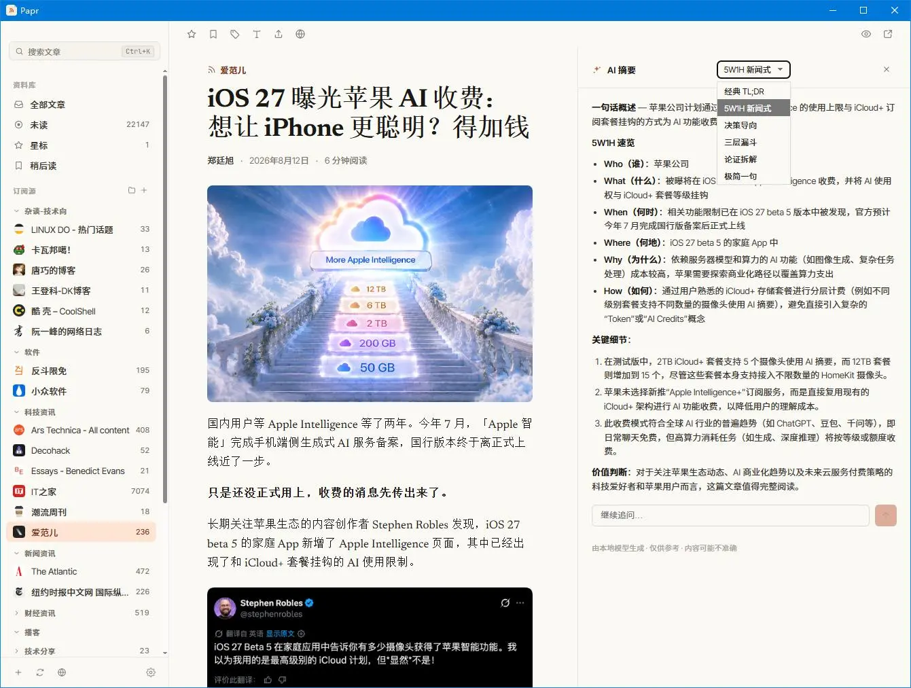

<div align="center">


# Papr

A fast, native RSS reader for the desktop.


</div>

## Features

- **Feeds & folders** — subscribe, organize, and import/export OPML.
- **Smart views** — All, Unread, Starred, and Read Later, with live counts.
- **Tags & rules** — color-coded tags and rules that tag new articles automatically.
- **Full-text** — fetch and clean the complete article when a feed ships only a summary.
- **AI** — summaries with inline follow-up Q&A, ask-the-article Q&A, and digests. Bring your own API key.
- **Audio** — a built-in player that follows you from article to article.
- **FreshRSS sync** — keep read state in step with a FreshRSS server.
- **Local-first** — everything in a local SQLite database. No account, no cloud.
- **Localized** — English, Japanese, and Simplified Chinese.

## 基于原仓库的修改

本仓库基于原始项目 [l0ng-ai/papr](https://github.com/l0ng-ai/papr) 的 `0.9.0` 版本继续改造。当前分支相对原仓库的主要变化如下。

### 已实现的功能改造

- **多模型 AI 配置**：将原先固定的 Anthropic / OpenAI 配置改造成协议化配置档，支持 Anthropic Messages 与 OpenAI Chat Completions 兼容接口；可配置 API Key、模型、Base URL、认证方式和自定义请求头，并保留旧版 `ai_provider`、`ai_api_key`、`ai_model`、`ai_base_url` 设置的兼容回退。
- **AI 连接测试**：在设置页新增 AI 配置保存与连接测试能力，测试失败时会隐藏 API Key，并对 TLS / 证书类错误给出更明确的提示。
- **摘要模板**：新增多种文章摘要模板，包括 Classic TL;DR、5W1H News、Decision helper、Three-layer funnel、Argument deconstruction、Ultra-minimal；默认模板可在设置中保存，也可以在阅读器的 AI 摘要面板里临时切换。
- **摘要追问**：在 AI 摘要抽屉中加入追问输入框，用户可以基于已经生成的摘要继续提问；追问回答保持流式输出，并使用当前摘要和临时问答历史作为上下文。

<p align="center">
  
</p>

- **AI 抽屉布局优化**：AI 摘要面板宽度从 360px 调整到 480px，打开面板时正文区域会为抽屉预留空间，减少正文与摘要面板的遮挡。
- **LLM 翻译配置对齐**：LLM 翻译会复用新的 AI 配置解析逻辑，同时保留 Google、DeepL、Bing 等独立翻译引擎选项。
- **国际化补充**：为新增的 AI 配置、摘要模板、追问和连接测试文案补齐 English、Japanese、Simplified Chinese 三套语言资源。

### 工程与构建调整

- **TLS / 打包修复**：调整 `reqwest` TLS 特性，启用 `rustls-tls-webpki-roots`、`system-proxy`、`http2` 等能力；同时在 Tauri 打包配置中启用 `useLocalToolsDir`，降低 Windows 环境下载/证书问题对打包流程的影响。
- **Windows 开发体验**：`pnpm dev` 启动前会先尝试释放 Vite 默认端口 `1430` 上遗留的 Node / Vite 进程，避免热重载服务因端口占用启动失败。
- **pnpm 构建脚本允许列表**：新增 `pnpm-workspace.yaml`，允许 `esbuild` 的构建脚本，减少安装依赖后的手工确认。
- **忽略本地敏感与工具状态**：扩展 `.gitignore`，忽略 `.env*`、本地 SQLite 数据库、CodeGraph、Playwright MCP、历史记录、缓存和覆盖率目录，避免把本地凭据或工具产物提交进仓库。

### 文档与规划补充

- **多 LLM 配置规格**：新增 `docs/multi-llm-provider-adapter-spec.md`，记录多供应商 LLM 配置层的目标架构、兼容策略和后续演进方向。
- **协作规则文档**：新增 `AGENTS.md` 以及 `docs/agents/*`，记录本仓库的 Agent 协作规则、Issue 追踪方式、标签约定和领域说明。
- **TLS 排障记录**：新增 `tls.md`，记录 Windows / 代理 / 证书链相关的 Tauri 打包排障过程和建议操作。

## Installation

### macOS

Install with [Homebrew](https://brew.sh):

```sh
brew install --cask l0ng-ai/papr/papr
```

### All platforms

Download the installer for your platform from the [latest release](https://github.com/l0ng-ai/papr/releases/latest).

## Development

### Prerequisites

- [Node.js](https://nodejs.org/) (v20+)
- [pnpm](https://pnpm.io/) (v9+)
- [Rust](https://www.rust-lang.org/tools/install) (latest stable via rustup)
- **Windows only**: WebView2 runtime (usually pre-installed) and MSVC build tools (installed via rustup).

### Install dependencies

```sh
pnpm install
```

If pnpm reports `Ignored build scripts: esbuild`, allow the build script:

```sh
pnpm approve-builds
```

### Run in development mode

```sh
pnpm tauri dev
```

This starts the Vite dev server and the Tauri desktop window with hot reload.

### Build the desktop app

```sh
pnpm tauri build
```

After the build completes, the installable bundles are located at:

```text
src-tauri/target/release/bundle/
```

On Windows you will typically find:

- `src-tauri/target/release/bundle/msi/Papr_*.msi`
- `src-tauri/target/release/bundle/nsis/Papr_*-setup.exe`

### Other useful scripts

```sh
pnpm dev        # Start the frontend dev server only (no Tauri window)
pnpm build      # Build the frontend for production
pnpm preview    # Preview the production frontend
pnpm test       # Run unit tests
```
