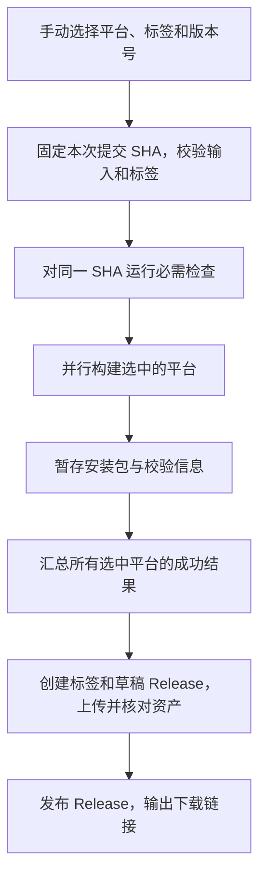

# Papr：日常 CI 与按需 Release 打包方案

设计日期：2026-10-05。状态：已完成代码实现及本地检查，待签名 Secrets 配置、提交推送与首轮云端验收。

## 1. 目标与已完成事项

- 日常提交检查前端、Rust 和 Flutter，不生成 Windows 安装包或 Android APK。
- 需要安装包时，由仓库所有者手动触发 GitHub Actions，在云端构建，并上传到本项目的 GitHub Release。
- Release 作为长期下载入口，本地不必保存历次安装包，也不必为了发布而执行完整本地构建。
- 首期目标为 Windows x64 与 Android；不增加服务器部署、商店分发或自动更新功能。

分支调整已经完成：本地 `optimize-bugfix` 和远端对应分支已改名为 `master`；GitHub 默认分支、本地跟踪分支和 `origin/HEAD` 均指向 `master`。提交仍是 `41b02fc94954eca6c2ddf15e6b357c80f0bea319`，上游继承的远端 `main` 保留。独立同步数据仓库 `Ryderey/papr-sync` 不受影响。

## 2. 推荐的触发规则

保留两个主要入口：`CI` 与 `Package Release`。

| 操作 | 日常检查 | 打包应用 | 上传 Release |
| --- | --- | --- | --- |
| 提交到 master | 是 | 否 | 否 |
| 提交面向 master 的 PR | 是 | 否 | 否 |
| 手动运行 Package Release，选择 Windows | 校验本次选定代码 | Windows | 是 |
| 手动运行 Package Release，选择 Android | 校验本次选定代码 | Android | 是 |
| 手动运行 Package Release，选择两端 | 校验本次选定代码 | Windows 与 Android | 是，两端放入同一个 Release |
| 单独创建标签 | 不因此启动打包 | 否 | 否 |

首期只用 `workflow_dispatch` 触发打包，不监听普通 push、PR 或标签 push。以后若需要“推送发布标签就打包”，再增加限定前缀的标签触发，避免与手动入口重复构建。

手动工作流需先存在于默认分支，随后可以在 Actions 页面通过 Run workflow 选择分支运行。[GitHub 手动工作流文档](https://docs.github.com/en/actions/how-tos/manage-workflow-runs/manually-run-a-workflow)

## 3. 日常 CI

调整现有 `.github/workflows/ci.yml`，监听 `master` 的 push 与面向 `master` 的 PR。

建议并行运行以下检查：

| Job | 环境 | 工作内容 |
| --- | --- | --- |
| frontend | Ubuntu 标准 runner | pnpm 锁定依赖安装、`pnpm build`、`pnpm test` |
| rust | Ubuntu 标准 runner | 安装现有 Tauri 所需系统库；检查 Rust workspace；运行桌面、papr-core、papr-flutter-bridge 的测试 |
| flutter | Ubuntu 标准 runner | 安装锁定 Flutter 工具链；`flutter pub get`、`flutter analyze`、`flutter test` |

`pnpm build` 会生成网页构建文件，Rust 检查也会编译代码，但均不执行桌面 bundler 或 Android APK 构建。Flutter 单元测试不触发 Android Gradle 的 Rust 交叉编译任务。

Rust 缓存以仓库根 workspace 为基准，修正现有 `workspaces: src-tauri` 与当前 Cargo workspace 结构不一致的问题。按 runner、目标架构及锁文件区分缓存，避免 Windows、Linux、Android 产物混用。Flutter bridge 已生成的绑定保持提交到仓库，普通 CI 不主动重生成。

同一 PR 或分支的新检查可取消旧检查，减少重复任务。首期不增加复杂的路径过滤；后续若跳过纯文档变更，需要兼顾必需检查，避免 PR 因检查未触发而一直等待。

## 4. 手动打包入口

新增 `.github/workflows/package-release.yml`，展示名称为 `Package Release`。首期建议仅有四个输入：

| 输入 | 含义 | 推荐默认值 |
| --- | --- | --- |
| platforms | windows、android 或 both | both |
| release_tag | 本次归档的唯一标签，例如 `papr-build-20261005-01` | 必填 |
| prerelease | 是否标记为预发布 | true |
| android_build_number | Android versionCode；选择 Android 时填写 | 不自动猜测，填写高于已安装版本的整数 |

GitHub 自带的分支选择器用于选择待构建分支，日常选择 `master`，不另加重复的分支输入。

首期默认构建成功后直接发布为预发布 Release，让手机浏览器可以下载；不把所有归档都设为 Latest。预发布是公开可下载的软件发布，只表示尚未作为正式稳定版。失败或资产不完整时保留草稿，不暴露为一次成功发布。

流程如下：



全部 job checkout 同一个完整提交 SHA。不能让两个平台分别读取运行期间不断变化的 `master` 最新提交。发布前的检查针对该 SHA，不能直接拿分支上另一次运行的通过结果代替。

## 5. Windows 打包

- 使用 Windows 标准 GitHub-hosted runner，构建 x64。
- 安装项目现有 pnpm、Node 与 Rust 工具链，锁定依赖安装。
- 通过 Tauri 构建 Release 模式的 NSIS 安装包，建议以 `pnpm tauri build --bundles nsis` 为实际命令基础。
- 首期只生成 `setup.exe`，MSI 后续确有需求再加。Tauri 官方支持 NSIS 和 MSI 两种 Windows 安装格式。[Tauri Windows 打包文档](https://v2.tauri.app/distribute/windows-installer/)
- 从根 workspace 的 `target/release/bundle/nsis/` 收集安装包，并检查数量、大小与 SHA-256；不能只凭 job 成功就假定安装包存在。
- 首期不要求购买 Windows 代码签名证书，安装包将是未做发布者代码签名的版本。

## 6. Android 打包与签名

- 使用 Ubuntu 标准 runner，JDK 17、项目固定的 NDK `30.0.14904198`。
- Flutter 精确版本与已验证的开发环境对齐。现有待提交工作流填写 `3.44.5`，实施时核对该版本可用且符合 `pubspec.lock` 的 Dart/Flutter 约束后锁定，不每次自动升级。
- 只交叉编译设备架构 `arm64-v8a` 与 `armeabi-v7a`，生成两个独立 APK；不打包模拟器 x86/x86_64。
- 复用当前 Gradle 的 `paprAndroidAbis` 参数，让 Flutter 的目标平台和 Rust bridge ABI 一致。
- 建议命令：`flutter build apk --release --split-per-abi --target-platform android-arm,android-arm64 --build-number <输入值>`。
- APK 包名保持 `com.papr.papr_mobile`，每次发布记录 versionName、versionCode、ABI 和签名证书指纹。

设计阶段发现签名衔接问题：Gradle 的 release 始终使用 debug signing，旧 Android 工作流写入的 `key.properties` 没有被读取。实施已补齐配置选择：完整 CI 环境值或本地属性文件会选中固定密钥，CI 强制签名且校验生成 APK 的证书；无密钥的本地内部构建保留 Debug 回退。

即使仅自己使用，也需要长期复用同一签名密钥。新 runner 自动生成的 debug 密钥不能作为持续更新方案；Android 更新校验签名，换证书可能导致现有安装无法覆盖更新。[Android 签名文档](https://developer.android.com/studio/publish/app-signing)

实施时需要：

1. 确定沿用的签名身份，并核对它与手机现有安装的证书是否匹配。若切换到新的发布密钥，先备份/同步现有数据，再安排首次迁移；不能承诺新密钥可直接覆盖当前 debug 版。
2. Gradle 读取四个 `PAPR_ANDROID_*` 环境值（CI 使用）或本地忽略的 `key.properties`。CI 只临时恢复 keystore，不另写密码属性文件；缺少配置时明确失败，不能静默回退到随机 debug 签名。
3. 在仓库 Actions Secrets 保存 `ANDROID_KEYSTORE_BASE64`、`ANDROID_KEYSTORE_PASSWORD`、`ANDROID_KEY_ALIAS`、`ANDROID_KEY_PASSWORD`。
4. 发布前使用 `apksigner` 检查签名，并校验证书指纹和 APK 元数据。只上传 APK 和公开证书指纹，不上传密钥文件或密码。
5. 签名文件仅落在 runner 临时目录，任务结束清理；密钥另做安全备份，不能随着本地构建缓存一起删除。

Android 的显示版本仍从 `mobile/pubspec.yaml` 读取。versionCode 由上述输入明确指定并逐次增加，不直接把新工作流的 `run_number` 当作迁移前已经有效的版本号。

## 7. Release 组织与失败恢复

Release 放在源代码仓库 `Ryderey/papr`，不放到个人订阅同步仓库 `Ryderey/papr-sync`。

桌面当前版本为 `0.9.0`，移动端为 `0.1.0+1`，无需为了同批归档强行修改为同一显示版本。采用 `papr-build-*` 标签表示“同一提交的一批安装包”，Release 正文分别列出两端真实版本。

示例资产：

```text
papr-build-20261005-01
├── Papr-windows-x64-0.9.0-<sha>-setup.exe
├── Papr-android-arm64-v8a-0.1.0-<code>-<sha>.apk
├── Papr-android-armeabi-v7a-0.1.0-<code>-<sha>.apk
├── SHA256SUMS.txt
└── build-info.json
```

`build-info.json` 记录提交 SHA、选中平台、两端版本、Android versionCode、工具链版本和 Actions run URL。Release 正文解释应该下载哪一个文件，并提供构建记录链接。

发布规则：

- 标签输入必须通过格式校验，通过环境变量传给 shell，不把用户输入直接拼进脚本代码。
- 新标签只在所有选中平台完成且产物检查通过后创建；已有标签必须指向本次构建 SHA，不匹配就失败，不移动旧标签。
- 发布 job 统一创建草稿、上传资产、核对资产集合后再发布；构建 job 不各自创建同一个 Release。
- 允许重试未完成的草稿，但已发布 Release 不自动覆盖同名资产。需要重新构建时使用新标签，避免下载地址不变却换了安装包。
- 同一标签发布串行，打包任务不自动取消正在执行的同标签任务；不同标签可各自运行。
- 选择 both 时任一平台失败，本轮不发布为完成状态。成功平台的短期中转 artifact 可用于排查或恢复，必要时重跑任务。
- 中转 Actions artifacts 建议只保留 3 天，长期文件留在 Release。中转文件必须成功上传到 Release 并核对后，才能视为归档完成。保留期可由 `retention-days` 控制。[GitHub artifacts 文档](https://docs.github.com/en/actions/tutorials/store-and-share-data)

这里只建立手动下载与安装入口。客户端不会因为增加 Release 就自动检查、下载或安装更新。

## 8. 现有工作流的处理

| 文件 | 当前情况 | 实施时的处理 |
| --- | --- | --- |
| `.github/workflows/ci.yml` | 仍只监听 main，缓存路径仍指向旧 workspace 位置 | 改为 master，补齐两端共享 Rust 与 Flutter 检查，修正缓存 |
| `.github/workflows/package-release.yml` | 尚不存在 | 新建统一手动打包及发布入口 |
| `.github/workflows/release.yml` | 上游遗留，v* 标签/手动触发，包含 macOS、Linux、Windows | 增加上游仓库限定，保留原能力但避免在当前 fork 重复打包；本 fork 使用新入口 |
| `.github/workflows/update-tap.yml` | 发布事件会尝试更新 l0ng-ai 的 Homebrew 仓库 | 限定上游仓库，避免本 fork 的 Release 触发无关任务 |
| `.github/workflows/android-release.yml` | 本地未跟踪的在编方案，带 android-v* 自动触发 | 先保留现有内容，再将有效步骤并入统一入口；不能同时启用两套 Android 发布入口 |
| `mobile/android/app/build.gradle.kts` | 本地已有 ABI 选择改动；release 仍用 debug 签名 | 在现有改动上补齐稳定签名接入，保留本地调试能力 |
| `README.md` | 尚无本方案使用步骤 | 补充手动打包、Release 下载、平台选择与签名迁移说明 |

表中“当前情况”为设计阶段的基线。实施在保留原 ABI 选择改动的基础上补齐签名，并把旧 Android 入口限定为上游仓库；新增统一手动工作流，没有删除旧方案或现有 keystore。

## 9. 权限、费用与本地空间

普通 CI 和构建 job 只需 `contents: read`；仅发布 job 使用 `contents: write` 创建标签和 Release，使用 GitHub 自动提供的 `GITHUB_TOKEN`，不用再申请个人 PAT。签名 Secrets 只用于自己手动启动的 Android 打包，不提供给 PR 检查。缓存不包含签名临时目录。

当前 `Ryderey/papr` 为公开仓库。标准 GitHub-hosted runner 的公开仓库使用免费；本方案选择标准 Windows/Ubuntu runner，避免 larger runner。若以后把源代码仓库改为私有，需要重新核对账户分钟数和存储额度。[GitHub Actions 费用说明](https://docs.github.com/en/actions/concepts/billing-and-usage)

GitHub 官方目前允许单个 Release 最多 1000 个资产，每个文件小于 2 GiB，并未设置 Release 总大小或带宽额度；Release 没有 Actions artifacts 那样的到期保留期，适合存放应用安装包。它仍受仓库、账户和服务政策约束，不应作为唯一备份。[GitHub Release 说明](https://docs.github.com/en/repositories/releasing-projects-on-github/about-releases)

公开仓库发布的 Release 也可被其他人下载。归档安装包只包含程序，不打包本地订阅数据库、同步 Token、AI 配置或签名密钥。

云端构建可减少以后本地发布产生的大量临时文件，但不会自动释放已有 `target/`、`mobile/build/`、Gradle 或 SDK 缓存。首轮 Release 下载并验证可安装后，可另行清理确定可再生的本地构建目录；本轮只清理实施生成的临时校验工具、测试密钥及下载文件。保留源代码、用户数据和签名密钥备份。

## 10. 实施与验收顺序

1. 合并整理现有 Android 在编改动，补齐签名衔接，核对当前安装包证书与版本号。
2. 调整日常 CI，增加新的手动打包工作流，并限定上游专属发布/Homebrew 任务。
3. 补齐 README，在 master 提交工作流，让 Run workflow 入口可用。
4. 推送一次普通代码变更：确认只有检查，没有 EXE/APK 打包或 Release 创建。
5. 首次手动选择 both，使用唯一的预发布标签：确认同一 SHA 的 Windows、Android 资产与校验信息完整上传，Release 可下载。
6. 下载验证 Windows 安装和启动；验证手机安装、签名及再次构建后的覆盖更新能力。
7. 分别选择 windows/android，确认不会启动另一平台的构建。模拟构建失败或标签冲突，确认不会发布不完整结果或覆盖旧资产。
8. 确认云端归档完整后，再单独处理本地可再生构建文件清理。

## 11. 实施检查记录

- 已实现复用 CI 的手动工作流、统一发布保护、APK 证书/版本/ABI 检查和隐藏输入的签名配置脚本。
- owner 确认沿用已有 `papr-release.keystore`；该文件保持原样，尚未输入密码或写入实际签名 Secrets。
- 前端构建和 89 项测试通过；Flutter analyze 和 40 项测试通过。
- 10 项发布保护回归通过，覆盖注入/标签拒绝、构建号、HTTP 错误、标签冲突、APK 证书/版本/ABI、资产完整性及草稿上传后才发布。测试使用独立版本 fixture，日常调整应用版本不会改变边界测试的输入。
- actionlint 1.7.12 验证修改的工作流通过；PowerShell 语法检查通过。
- Gradle Kotlin 配置编译通过；缺少强制签名配置会失败；临时测试密钥的配置绑定与 signingReport 成功。测试没有使用用户发布密钥或生成 APK。
- 使用一次性 PKCS12 测试密钥验证 keytool 隐藏环境密码输入；若 keytool 忽略独立私钥密码，脚本会保存实际用于签名的 store 密码。
- GitHub Actions 已开启，默认分支为 master；真实仓库只读发布预检通过。Android 实际云端打包、固定密钥安装及设备覆盖升级仍待签名配置后验收。
- 首次云端运行发现原 CI 的 pnpm 9 不兼容当前 workspace 配置；已固定为本地验证使用的 pnpm 11.5.0，同时用 packageManager 字段声明版本，修复后重新验收。
- 首轮 Windows 安装包构建成功，但发布脚本错误地用按标签查询的接口读取草稿，停止在空草稿阶段。已改为分页查询草稿、核对 target_commitish，并在发布后验证最终标签 SHA；[GitHub 文档](https://docs.github.com/en/rest/releases/releases#get-a-release-by-tag-name)说明按标签接口只返回已发布 Release。回归测试模拟这个实际 API 行为。
- 修复后的[普通 CI](https://github.com/Ryderey/papr/actions/runs/37345156802)全部通过，没有打包；[Windows 手动运行](https://github.com/Ryderey/papr/actions/runs/37345208121)全部通过，Android job 按选项跳过。
- [预发布 papr-build-20261006-02](https://github.com/Ryderey/papr/releases/tag/papr-build-20261006-02)包含 Windows x64 安装器和三份校验/构建信息文件，标签指向 `361a06f0d5a7f4681817fd836a7c797936a37f34`。安装器大小为 5,977,589 字节。尚未执行安装器或验证 Windows 安装启动。
- 已下载全部四个资产并核对 GitHub 的 digest、字节数、SHA256SUMS 和构建 SHA，全部一致。确认新 Release 完整后，清理了失败验收留下的空草稿；临时验证文件也随本轮收尾清理。
