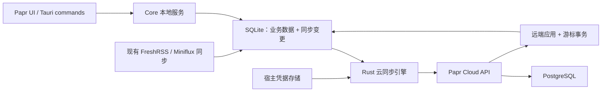

# NewsNook 云端同步方案调研与 Papr 借鉴评估

调研日期：2026-10-04。来源为本地 `newsnook`，HEAD：`b01e72d8429499b08d33975baeb931667a407d57`。本轮以源码、测试定义、数据库迁移和部署文档交叉检查，不修改业务代码，不读取实际凭据，不启动服务或数据库，不拉取远端仓库。下文区分已实现行为与需要验证的推断。

## 1. NewsNook 实际同步边界

这是可选账户与配置同步服务：客户端仍自行获取 RSS、解析正文和读取缓存；未登录不创建同步引擎，云端不可达不阻断本地阅读。入口已连接到 React 运行时，并非只有设计稿。[useCloudSync.ts](newsnook/src/features/sync/useCloudSync.ts:105)、[runtimeAdapter.ts](newsnook/src/features/sync/runtimeAdapter.ts:54)、[部署边界](newsnook/docs/cloud-deploy.md:3)

| 同步域 | 实现内容 | 不应误认为已支持 |
|---|---|---|
| subscription | 内置源启停、自建源定义、名称、URL、排序；内置源停用产生删除，自建源停用仍保留定义 | 文章库、正文、列表缓存 |
| category | 分类启停、顺序、名称、源归属 | 通用树形文件夹及外键映射 |
| setting | 排版、主题、配色、翻译配置、朗读配置、代理模式/分流域名、自动刷新、本地推荐开关、场景预设 | 任意本地配置全部同步 |
| secret | 翻译/AI Provider Key、代理地址等 | 端到端加密或所有凭据安全上云 |

协议只有这四种实体；设备相关设置另有排除表。已读、稍后读、阅读位置、历史与缓存不在其 V1 同步域。[协议枚举](newsnook/packages/contracts/src/protocol.ts:25)、[订阅投影](newsnook/src/features/sync/projection.ts:232)、[设置投影](newsnook/src/features/sync/projection.ts:335)、[本地设置排除](newsnook/src/features/sync/projection.ts:39)、[项目约束](newsnook/AGENTS.md:109)

## 2. 值得借鉴的机制

### 本地写入、投影与 Outbox

本地配置是真相，同步从完整本地投影计算变化：与服务端已确认的 `shadow`、待发送 Outbox 指纹比较，生成包含 `mutationId`、`baseRevision` 的实体 upsert/delete。它专门弥补“本地配置写成功、Outbox 写之前崩溃”的窗口，下次对账能补回改动。这里没有要求每个业务写入同步事务化，适合其规模较小的配置模型；对于已有 SQLite 事务日志的项目，应复用现有日志边界。[reconcile.ts](newsnook/src/features/sync/reconcile.ts:1)

Secret 明文从 Outbox 擦除，发送时才从最新投影取值；指纹不匹配的旧 Secret 操作作废。普通实体 Outbox 则保留发送载荷。[reconcile.ts](newsnook/src/features/sync/reconcile.ts:73)、[materializeMutation](newsnook/src/features/sync/reconcile.ts:114)

### 可恢复的 push/pull

引擎流程是 journal 重放 → 本地对账/push → 分页 pull → 应用 → 更新 shadow/cursor。单飞合并并发触发，本地变化延迟 1.5 秒发送；启动、前台恢复、网络恢复和手动触发同步，没有轮询/WebSocket。网络失败退避，认证/设备撤销等致命错误暂停自动重试。[SyncEngine.ts](newsnook/src/features/sync/SyncEngine.ts:140)、[同步周期](newsnook/src/features/sync/SyncEngine.ts:164)、[触发策略](newsnook/src/features/sync/useCloudSync.ts:28)、[失败处理](newsnook/src/features/sync/SyncEngine.ts:397)

push 确认时只将 shadow 更新为“已发送操作的指纹”，避免把请求在途时的新编辑误认成已上传；每轮重新投影，最多追赶 5 轮。pull 会保护仍在 Outbox 中的实体，避免直接覆盖待发送改动。这些细节应作为 Papr 实现与测试的验收合同。[在途编辑处理](newsnook/src/features/sync/SyncEngine.ts:197)、[确认指纹](newsnook/src/features/sync/SyncEngine.ts:272)、[pending 保护](newsnook/src/features/sync/SyncEngine.ts:350)

应用远端数据前先持久化 journal，应用完成后推进 cursor/shadow 再清 journal，崩溃可重放；远端数据进入 shadow 后，下轮对账避免产生回声。[applyRecords](newsnook/src/features/sync/SyncEngine.ts:346)、[advanceShadow](newsnook/src/features/sync/SyncEngine.ts:632)

### 服务端事务、版本与删除传播

Fastify + Better Auth + 外部 PostgreSQL。每用户一条 `sync_heads`，push 事务对 head 行 `FOR UPDATE`，分配严格递增 revision；实体变更、mutation 幂等结果、冲突与 head 在同一事务提交。一个批次可业务上部分接受/部分冲突，校验等异常则数据库整体回滚。重发相同 `mutationId` 返回原结果，不生成新 revision。[服务事务](newsnook/cloud/src/sync/service.ts:62)、[push](newsnook/cloud/src/sync/service.ts:198)、[行锁与幂等](newsnook/cloud/src/sync/repository.ts:50)、[事务回滚测试](newsnook/cloud/tests/sync.integration.test.ts:322)

pull 查 `revision > cursor` 的实体最新状态，不存完整历史 change log；非末页推进到最后一条 revision，末页推进到读取的 head。删除保留 `deleted_at` 墓碑并参与拉取；客户端 overlay 移除删除实体。“使用本机覆盖云端”也为云端多余对象留墓碑，而非清空表。[pull repository](newsnook/cloud/src/sync/repository.ts:324)、[分页 cursor](newsnook/cloud/src/sync/service.ts:176)、[墓碑](newsnook/cloud/src/sync/repository.ts:247)、[客户端删除](newsnook/src/features/sync/merge.ts:56)、[基线替换](newsnook/cloud/src/sync/service.ts:373)

### 有针对性的冲突和首次同步交互

普通设置、Secret 与未删除订阅更新采用服务端提交顺序收敛；陈旧订阅删除、对已删订阅更新、分类结构分歧进入人工冲突队列。分类陈旧更新若载荷一致则 noop。同实体未解决冲突复用一条，允许选本机或云端；这是实体级策略，不能称为通用字段级合并或 CRDT。[冲突分类](newsnook/cloud/src/sync/conflicts.ts:63)、[冲突去重](newsnook/cloud/src/sync/service.ts:263)

首次同步支持本机/云端/合并，双方有内容必须选择；日常同步在完成首次决策前停止，避免新安装默认值覆盖云端。`hasContent` 实際不把纯 setting 计为内容；“合并”走先 push 本地再 pull 的普通流程，不是预先进行所有字段的无损集合合并。需结合目标项目定义重新设计。[firstSync.ts](newsnook/src/features/sync/firstSync.ts:42)、[首次门禁](newsnook/src/features/sync/SyncEngine.ts:170)、[三个动作](newsnook/src/features/sync/SyncEngine.ts:472)

## 3. 账户、Secret 与跨应用隔离

服务端 userId 来自已验证 Session，实体和 revision 按 userId 分区；设备所属用户、撤销状态和设备会话关联有检查。撤销设备保留其上传数据，同时作废关联会话，不能把 deviceId 当账户权限本身。[authSession.ts](newsnook/cloud/src/plugins/authSession.ts:56)、[ensureDevice/revokeDevice](newsnook/cloud/src/sync/service.ts:86)、[表约束](newsnook/cloud/migrations/001_cloud.sql:86)

Web 通过 HttpOnly Cookie；原生长期 bearer 存 Keystore，第三方登录走系统浏览器与短期一次性 token 回流。来源白名单和深链当前带 NewsNook 品牌绑定；Papr/Tauri 不能直接套用其 Android 适配器。[authClient.ts](newsnook/src/features/account/authClient.ts:1)、[secureStore.ts](newsnook/src/features/account/secureStore.ts:76)、[Better Auth 装配](newsnook/cloud/src/auth.ts:50)、[trustedOrigins](newsnook/cloud/src/auth.ts:95)、[固定回调](newsnook/packages/contracts/src/protocol.ts:49)

Secret 服务端 AES-256-GCM 静态加密，AAD 绑定 userId 与 Secret key；服务端可解密，属于其明确接受的非 E2EE 边界。keyVersion 已有字段，目前解密只接受当前版本，不能把它当完整密钥轮换实现。Web Secret 普通 localStorage 行为明确保留。[secrets.ts](newsnook/cloud/src/crypto/secrets.ts:1)、[版本判断](newsnook/cloud/src/crypto/secrets.ts:67)、[Web 存储边界](newsnook/src/features/account/secretStore.ts:12)

原服务没有 appId/应用租户维度：协议限定 NewsNook 四种实体，数据库身份主要为 userId + entityId，setting 使用如 theme/translation/presets 的共享键，基线替换遍历该用户所有同步实体。因此共用现有服务和同一账户可能混合两个应用的数据；仅增加客户端来源白名单不能解决数据隔离。优先独立服务/数据库实例，或显式加入 app/tenant 分区后才评估多应用复用。[实体 schema](newsnook/packages/contracts/src/sync.ts:108)、[实体唯一键](newsnook/cloud/migrations/001_cloud.sql:105)、[setting 键](newsnook/src/features/sync/projection.ts:22)、[基线替换范围](newsnook/cloud/src/sync/service.ts:386)

## 4. 实现与设计的差距、移植前需验证的条件

1. **账号/服务环境切换范围不足**：同步状态、journal 和安全存储键全局保存，缺少 userId + server/environment 绑定。UI 的退出按钮会 reset 同步元数据，但引擎 reset 没有在途取消/世代校验；账户 hook 恢复/失效路径也没有统一同步所有者校验。移植时应把状态分区和旧请求结果拒收放在服务边界，不能依赖某个设置页按钮。这里是源码推断，未做动态切换复现。[本地状态](newsnook/src/features/sync/types.ts:76)、[存储键](newsnook/src/lib/storage.ts:20)、[安全键](newsnook/src/features/account/secureStore.ts:27)、[UI 登出](newsnook/src/screens/settings/AccountSyncScreen.tsx:1020)、[reset](newsnook/src/features/sync/SyncEngine.ts:598)
2. **Secret journal 存储需要专项验证**：pull 返回解密后的 Secret，journal 形状是完整 `SyncRecord[]`；当前 journal 持久化路径没有类似 Outbox 的 Secret 脱敏，而普通存储还会镜像到原生 Preferences。源码显示恢复日志保护与 Secret 存储目标存在缺口，成功清 journal 不能替代安全的持久化设计。未读取任何实际 Secret，未做攻击验证。Papr V1 宜暂不上传 Secret；若后续加入，journal/备份/日志/落盘失败都应纳入安全存储审查。[pull 载荷](newsnook/cloud/src/sync/repository.ts:363)、[journal 形状](newsnook/src/features/sync/types.ts:94)、[journal 写入](newsnook/src/features/sync/SyncEngine.ts:359)、[持久化入口](newsnook/src/features/sync/state.ts:187)、[普通存储](newsnook/src/lib/storage.ts:136)、[journal 保存](newsnook/src/lib/storage.ts:298)
3. **并发分页一致性尚未证明**：pull 不在事务快照中读取 head 与四张实体表，也没有用同一个 revision 上界筛选各表。现有静态测试覆盖分页和并发 push，但未看到跨表 pull 与 push 交错分页的回归用例。移植应验证是否漏记录，并考虑一致快照/单查询或明确上界协议；不要把当前测试存在等同该场景已验证。[pull service](newsnook/cloud/src/sync/service.ts:176)、[逐表查询](newsnook/cloud/src/sync/repository.ts:334)、[现有分页测试](newsnook/cloud/tests/sync.integration.test.ts:398)
4. **URL 去重只看到基础字段**：存在 normalizedUrl 生成和非唯一索引，但 upsert 仍按 entityId 写入，没有找到跨设备相同 URL、不同 ID 的映射与归并。因此“合并会按 URL 去重”不能作为已实现能力承诺。[URL 归一化](newsnook/src/features/sync/projection.ts:203)、[索引](newsnook/cloud/migrations/001_cloud.sql:122)、[实体写入](newsnook/cloud/src/sync/service.ts:347)
5. **可插入排序键未贯穿现有投影**：协议有 rankBetween，实际订阅投影用 rankForIndex 重建顺序，不能承诺重排仅更新一条记录。[排序工具](newsnook/packages/contracts/src/protocol.ts:67)、[实际投影](newsnook/src/features/sync/projection.ts:253)
6. **保留策略是小规模配置的取舍**：V1 明确不自动清墓碑，未实现 cursor 过期/重建基线协议；mutation 幂等结果也持续落库。对大量文章状态不能直接照搬无限保留；若未来加入 GC，应先定义 retention、过期 cursor、完整重同步与幂等有效期。[墓碑设计](newsnook/docs/superpowers/specs/2026-08-27-account-cloud-sync-design.md:284)、[幂等表](newsnook/cloud/migrations/001_cloud.sql:93)
7. **持久化失败与拉取时编辑仍需补验证**：普通 storage 写失败仅记录告警，adapter 的 journal/state 写入返回 void；引擎可能无法感知恢复日志是否真正落盘。pending 保护只检查已入 Outbox 的变更，不能自动证明 pull 请求在途的尚未对账本地编辑都安全。应补失败注入及延迟请求测试。[storage 写失败](newsnook/src/lib/storage.ts:136)、[adapter 合同](newsnook/src/features/sync/SyncEngine.ts:57)、[pending 过滤](newsnook/src/features/sync/SyncEngine.ts:350)

## 5. 验证与运维成熟度

源码已包含协议、客户端投影/引擎/账户/Secret 水合/运行时/UI 测试，以及真实 PostgreSQL 集成测试。服务端用例明确覆盖并发同用户 push、mutation 重放、整个事务回滚、分页 cursor、墓碑、跨用户隔离、设备撤销与冲突裁决；CI 配置会提供 PostgreSQL 并运行这些测试、lint 和构建。这证明有完整验证基础，不代表本轮测试已运行或当前 CI 已通过。[测试脚本](newsnook/package.json:129)、[服务端用例](newsnook/cloud/tests/sync.integration.test.ts:154)、[访问隔离](newsnook/cloud/tests/sync.integration.test.ts:535)、[CI](newsnook/.github/workflows/cloud-sync-ci.yml:39)

本轮只做静态检查；本地 source checkout 未安装 `node_modules/.bin/tsx.cmd`，因此不通过安装依赖、触碰数据库来补跑测试。集成测试缺少 TEST_DATABASE_URL 会跳过，不能误报通过。[测试数据库门禁](newsnook/cloud/tests/sync.integration.test.ts:154)

部署支持单机 API 容器 + 外部 PostgreSQL、显式数据库迁移、健康探针、反向代理 TLS、备份与恢复演练说明；没有 Redis/MQ/后台 worker。对 Papr 来说仍会新增实际服务运维责任，并非“免费同步”。密钥与数据库备份需分别保管。[部署组成](newsnook/docs/cloud-deploy.md:9)、[显式迁移](newsnook/docs/cloud-deploy.md:45)、[恢复演练](newsnook/docs/cloud-deploy.md:170)

源码许可证为 GNU AGPL v3；Papr 的 MIT 许可与其不同。架构思路可以作为研究参考；如果后续复制代码、契约或服务实现，应先评估来源许可及目标发布/部署方式，不能默认按 MIT 复用。本报告不作具体法律兼容性结论。[NewsNook LICENSE](newsnook/LICENSE:1)

## 6. Papr 的现状与迁移可行性

### 6.1 结论与边界

**可以借鉴，推荐采用“本地优先的配置同步 + 保留既有 GReader 阅读状态同步”的组合。架构思路匹配度高，客户端源码直接复用度低，后端需要按 Papr 的实体和账户边界适配。**

这里的“可以”是基于本地源码的架构判断，不代表已经验证部署、跨设备同步或现有服务兼容性。本轮没有接入任何云服务。

Papr 并非没有同步能力：

| 能力 | 当前实现 | 对本次借鉴的意义 |
| --- | --- | --- |
| 桌面同步 | 独立的 Tauri/Rust GReader 实现，支持 FreshRSS 与 Miniflux | 保留其外部阅读服务用途；不要直接替换成 NewsNook Cloud |
| 共享 Core 同步 | Rust `SyncPort` / `SyncService`，事务性变更日志、provider 游标、remote ID 映射 | 可作为新云同步的基础，但当前协议和数据库应用逻辑必须扩展 |
| 云端应用配置同步 | 当前 reviewed 实现没有 NewsNook 类账户和配置同步闭环 | 正是可补齐的能力 |
| 标签、规则、高亮 | Core 会写变更日志，但当前同步批次和 DTO 不放行这些实体 | “有日志”不等于“已经可同步” |
| 设置 | 现有设置写入没有追加同步变更日志 | 需要配置白名单、投影、版本和写入追踪 |

证据：[桌面同步流程](src-tauri/src/sync.rs:322)、[Core SyncPort](crates/papr-core/src/sync.rs:97)、[Core SyncService](crates/papr-core/src/services/sync.rs:193)、[同步批次过滤](crates/papr-core/src/db.rs:2084)、[设置写入](crates/papr-core/src/db.rs:2043)。

### 6.2 最值得借鉴的部分

1. **业务先落本地、同步异步执行。** UI 不因未登录、断网或云故障失去订阅与阅读能力；云是本地数据的同步投影。
2. **显式划分同步域。** 对设置建立白名单，避免把“整个 SQLite 文件”或“所有 settings 键”当作同步对象。
3. **持久化待上传变更、服务器确认后再消费。** 借鉴 Outbox、幂等 operation ID、服务器版本与增量游标；Papr 已有事务日志和连续 ACK 思路，可以继续利用。
4. **区分首次合并、日常增量和冲突处理。** 首次登录既要扫描已有数据，也要保留本地尚未上传的修改；冲突不应静默覆盖用户操作。
5. **远端应用和游标落盘保持一致。** Papr Core 已在同一 SQLite 事务应用远端状态并更新 pull 游标；这一点比直接复制 localStorage 的 apply journal 更适合本项目。
6. **账户和 Secret 分开。** 账户可以晚于本地功能接入；Secret 同步作为独立范围，不要混入通用设置 payload。

证据：[Core 事务应用远端与游标](crates/papr-core/src/db.rs:2198)、[事务中业务写入与日志](crates/papr-core/src/db.rs:1702)、[连续 ACK 算法](crates/papr-core/src/sync.rs:218)。NewsNook 对应协议、引擎与首次同步证据见前文。

### 6.3 不能直接接上的地方

**A. 桌面和 Core 写入不统一。** 桌面数据库仅复用 Core 的 migration，许多业务 SQL 仍由 `src-tauri/src/db.rs` 执行。例如桌面 `mark_read` 更新状态后写旧 `sync_queue`，并没有写 Core `change_log`；桌面创建、删除文件夹和订阅也不经过 Core 的事务日志。因此，仅在 Core 加一个云 adapter，桌面变更仍可能完全不上云。后续应覆盖首期同步域的所有桌面写入入口，或将这些入口委托到 Core 服务；无需为本需求迁移无关业务。

证据：[桌面复用 migration](src-tauri/src/db.rs:38)、[桌面已读写入](src-tauri/src/commands.rs:340)、[桌面文件夹写入](src-tauri/src/db.rs:116)、[桌面订阅删除](src-tauri/src/db.rs:390)。

**B. 同步 DTO 不同。** Papr 当前 `SyncEntity` 只有 Folder/Feed/Article；`SyncChange` 是字段和值的简化模型。NewsNook Cloud 还有实体版本、操作 ID、配置/Secret 域等语义。应定义 Papr 的 Cloud DTO 和实体投影，而不是把设置或规则硬塞进 GReader 字段。可共享事务、调度、HTTP 与错误处理，业务协议允许分开。

证据：[现有 DTO 范围与形状](crates/papr-core/src/dto.rs:390)。

**C. 跨设备 ID 和删除尚未形成闭环。** migration 虽增加了 `sync_id` / `deleted_at`，但普通新增路径没有生成 sync ID；删除仍直接物理删除后记录日志。现有 pull 跳过 Tombstone，GReader push 对删除只确认并跳过。故不能将这些列和枚举视为“已有完整云删除能力”。新方案必须在删除前保留稳定身份及必要 payload，定义墓碑应用与保留期，防止离线设备把已删除订阅重新带回。

证据：[schema](crates/papr-core/src/db.rs:497)、[新增文件夹](crates/papr-core/src/db.rs:781)、[Core 删除订阅](crates/papr-core/src/db.rs:1057)、[跳过远端墓碑](crates/papr-core/src/db.rs:2202)、[GReader 跳过删除](crates/papr-core/src/sync/greader.rs:243)。

**D. 更复杂实体需要关联重映射。** 规则引用本地 `feed_id`，高亮引用本地 `article_id`，文章与标签之间还有关联表；SQLite 数字 ID 不能直接作为跨设备 ID。现有 tag attach/detach 日志也没有携带被操作的标签身份。若进入二期，须使用稳定实体 ID、文章身份和关联 payload，并处理“另一设备尚未抓到该文章”的延迟应用。

证据：[规则关联](crates/papr-core/src/db.rs:1827)、[高亮关联](crates/papr-core/src/db.rs:1943)、[文章标签日志](crates/papr-core/src/db.rs:1429)。

**E. 登录与凭据必须按宿主适配。** NewsNook 的 Web/Capacitor 账户入口不能原样用于 Tauri。Papr 桌面已经有 `papr://subscribe` 深链入口，但不是账户 OAuth 回调；桌面 GReader token 持久化在 settings，Core 的同步 profile 则只保存凭据引用。Cloud session、回调、注销和撤销应建立一致的宿主边界及安全存储接口；不要同步本机 credential_ref 代替真正的跨设备凭据设计。

证据：[桌面现有深链状态](src-tauri/src/state.rs:31)、[桌面 GReader 凭据持久化](src-tauri/src/sync.rs:248)、[Core 非敏感 profile](crates/papr-core/src/services/settings.rs:78)。本轮不要求扩展移动端。

### 6.4 推荐的落地形态（仅建议，未实施）

- 共享核心放在 `crates/papr-core`，Tauri 负责宿主凭据、登录回调、调度与 UI 通知；React 负责交互。
- Cloud 协议应独立于 GReader 协议，按 Papr 的实体建模；复用现有 Core 基础不意味着当前 `SyncPort` 可以零修改覆盖配置云同步。
- 云端可借鉴 Fastify/PostgreSQL/账户服务的分层与部署结构，但先使用独立实例或明确应用命名空间，不能把 Papr 直接接入现有 NewsNook 生产账户数据。
- 远端应用不再次生成本地上传变更，防止同步回环。
- GReader 与 Cloud 的写入权要明确：首期 GReader 继续管理阅读状态；若两者都同步订阅，应决定权威来源和删除规则，或在首期连接模式中避免同一订阅集被两套同步同时管理。

### 6.5 建议分期与工作量判断

| 阶段 | 范围 | 复杂度与前置条件 |
| --- | --- | --- |
| 设计确认 | 配置白名单、GReader 共存模式、账户隔离、稳定 ID、冲突与删除语义 | 必须先明确；避免重复设计两套同步真相 |
| 首期 | RSS 订阅、文件夹/顺序、非敏感阅读与外观设置 | 中等偏大；包含账户、客户端协议、数据库写入覆盖和后端，不是只加设置页 |
| 二期 | 标签、规则、高亮；按需求评估已读/星标/稍后读 | 较大；跨设备关联、文章身份、离线冲突与缺失文章处理 |
| 单独评估 | API Key、代理/IMAP/GReader 凭据等 Secret | 独立安全与产品范围；不建议放进首期 |

首期排除正文、全文/列表缓存、FTS 索引、AI 结果缓存、窗口位置、本机路径、系统代理/运行时调度值及凭据。AI provider 的非敏感 metadata 可以后续同步，但必须拆除桌面现有配置内嵌的 API Key，不可整体上传 `ai_profiles_json`。

证据：[桌面 AI 配置包含 API Key](src-tauri/src/ai.rs:137)、[Core AI metadata 保存](crates/papr-core/src/services/settings.rs:268)。以上分期和复杂度为调研推断，未给出未经实现验证的工期。

### 6.6 后续实现的验收重点

这是一组未来测试建议，本轮未执行这些测试：

1. 未登录、断网、服务故障不影响本地读写；重新联网可恢复。
2. 本地业务写入与待同步记录原子提交；崩溃后重放不丢变更。
3. 服务端接受后、客户端确认前中断，重试不重复创建实体。
4. 请求进行中再次修改同一实体，旧 ACK 不清除新变更。
5. 两设备独立添加同一 RSS URL，按明确身份规则去重；文件夹同名处理也有规则。
6. 离线删除、另一端修改及旧设备回归，不出现无提示的订阅复活。
7. 首次同步覆盖历史已有数据，且本地、云端都非空时可明确选择合并策略。
8. 账户 A→B、服务地址切换、注销、设备撤销期间的在途请求和 outbox/cursor 严格隔离。
9. 同时编辑与重排产生可解释冲突；分页 pull 与并发 push 不漏数据。
10. 桌面所有首期写入入口（包括导入、批量操作）产生同步变更；远端 apply 不触发上传回环。
11. Cloud 与 GReader 共存时，订阅和阅读状态不会互相覆盖或反复往返。
12. 设置白名单和日志/恢复记录中不出现 Secret；若以后启用 Secret，同步临时状态也应采用安全存储。

### 6.7 许可证边界

NewsNook 本地 [LICENSE](newsnook/LICENSE:1) 为 GNU AGPLv3，Papr [LICENSE](LICENSE:1) 为 MIT。**参考架构并在本项目内重新实现，与直接复制、修改、部署其源码，应分别评估。** 不应把直接复制来的 AGPL 源码当作 MIT 代码发布。

GNU 官方解释了 AGPL 对网络交互用户获取对应源码的要求；实际源码复用或服务修改的具体义务，需要按复用方式及授权确认，本文不作许可证适用范围的法律结论。来源：[GNU：Why the Affero GPL](https://www.gnu.org/licenses/why-affero-gpl.html)、[GNU License FAQ](https://www.gnu.org/licenses/gpl-faq.en.html)。

## 7. 本轮变更和验证记录

- 本轮产物仅为本调研文档；没有修改 Papr 或 NewsNook 代码、依赖、配置，没有创建开发任务、启动实现或部署服务。
- 方法：读取两个项目本地源码、协议、数据库迁移、测试源码与设计/部署文档；逐项区分实际实现、设计约定和调研推断。
- 验证：静态源码对照与引用路径/行号检查。测试源码用于确认已有覆盖范围，不等于测试已经运行。
- 未执行构建、单元测试、PostgreSQL 集成测试、云端连通性、OAuth 回调或双设备验证。原因：本轮为方案调研，没有功能实现；运行服务并非本次范围。
- 结论适用于 2026-10-04 可见的本地 checkout；未 fetch/refresh NewsNook。
